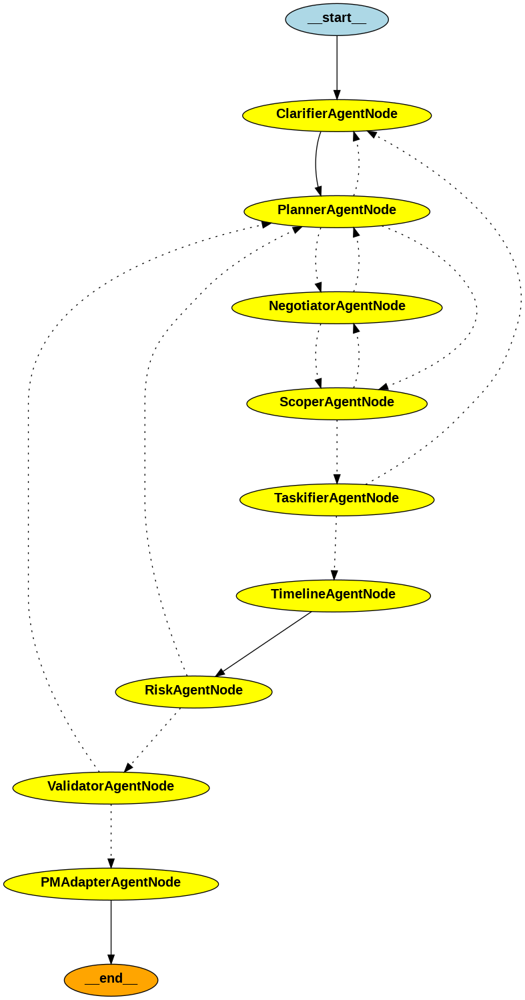

# ImbizoPM

ImbizoPM is a tool to help you get started with your GitHub projects by automating the creation of repositories, projects, and issues.

## Installation

```bash
# Clone the repository
git clone https://github.com/KameniAlexNea/ImbizoPM.git
cd ImbizoPM

# Install the package
pip install -e .
```

## Configuration

Set your GitHub Personal Access Token as an environment variable:

```bash
export GITHUB_TOKEN=your_github_token
```

Alternatively, you can create a `.env` file in the root directory:

```
GITHUB_TOKEN=your_github_token
```

For AI-powered project generation, you'll need an API key for your preferred LLM provider:

```bash
# For OpenAI
export OPENAI_API_KEY=your_openai_api_key

# For Anthropic
export ANTHROPIC_API_KEY=your_anthropic_api_key

# For Ollama (local setup)
export OLLAMA_BASE_URL=http://localhost:11434
export OLLAMA_MODEL=phi4
```

## Usage

### Creating a Repository

```bash
imbizopm create-repo --name my-awesome-project --description "This is an awesome project"
```

### Creating a Project Board

```bash
imbizopm create-project --repo my-awesome-project --name "Version 1.0" --description "First release of the project"
```

### Creating an Issue

```bash
imbizopm create-issue --repo my-awesome-project --title "Implement feature X" --body "We need to implement feature X with these requirements..."
```

### Creating a Project with Issues

Create a JSON file with issue definitions:

```json
[
  {
    "title": "Setup project structure",
    "body": "Create the initial project structure with necessary folders and files",
    "labels": ["documentation", "good first issue"]
  },
  {
    "title": "Implement core functionality",
    "body": "Implement the core functionality of the application",
    "labels": ["enhancement"]
  }
]
```

Then run:

```bash
imbizopm create-full-project --repo my-awesome-project --project-name "Sprint 1" --issues-file issues.json
```

### AI-Powered Project Creation

Generate a project structure using an AI model and create it on GitHub:

```bash
imbizopm ai-project --prompt "Create a task management application with user authentication"
```

With specific provider:

```bash
imbizopm ai-project --provider openai --model gpt-4 --prompt "Create a Python web scraper with proxy rotation"
```

Generate without creating on GitHub:

```bash
imbizopm ai-project --prompt "Create a mobile app for tracking fitness" --dry-run --save-tasks project-tasks.json
```

Available LLM providers:

- `openai`: OpenAI GPT models (requires OPENAI_API_KEY)
- `anthropic`: Anthropic Claude models (requires ANTHROPIC_API_KEY)
- `ollama`: Local Ollama models (requires Ollama running locally or specified OLLAMA_BASE_URL)

### Multi-Agent System for Project Analysis

ImbizoPM also features an advanced project analysis capability powered by a Multi-Agent System (MAS). In this approach, multiple specialized AI agents collaborate and discuss the project requirements to generate a comprehensive plan, including tasks, milestones, and potential risks.

This system leverages frameworks like LangGraph to orchestrate the interaction between agents, ensuring a robust and detailed analysis. The core agents involved in this process include:

* **ClarifierAgent**: Refines the initial project idea, extracts key goals, scope, success criteria, and constraints.
* **PlannerAgent**: Breaks down the clarified project into logical phases, epics (large bodies of work), and high-level strategies.
* **ScoperAgent**: Defines the Minimum Viable Product (MVP) scope, identifies potential overload, and suggests adjustments to fit constraints.
* **TaskifierAgent**: Generates detailed, actionable tasks based on the plan, assigning owner roles, estimating effort, and identifying dependencies.
* **TimelineAgent**: Estimates task durations, maps tasks onto a timeline, and identifies key project milestones and the critical path.
* **RiskAgent**: Assesses the feasibility of the plan, identifies potential risks, contradictions, or dealbreakers, and suggests mitigation strategies.
* **ValidatorAgent**: Verifies the alignment between the initial idea, the defined goals, and the generated plan components (tasks, timeline, risks).
* **NegotiatorAgent**: Facilitates conflict resolution between agents when disagreements or inconsistencies arise (e.g., scope vs. plan conflicts).
* **PMAdapterAgent**: Synthesizes the final, validated plan into a comprehensive summary and formats it for export to project management tools.

This collaborative process allows for iterative refinement and validation, leading to a more well-defined and realistic project plan.

You can see this in action and visualize the agent graph in the example notebook: [`examples/ImbizopmAgentsTest.ipynb`](./examples/ImbizopmAgentsTest.ipynb).



## License

MIT
